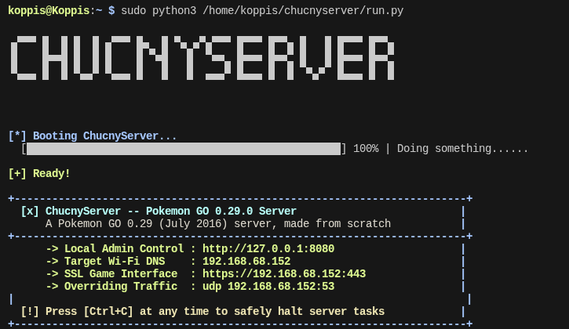

## ChucnyServer

</img> 
</img></img>

### 📁 Overview
**ChucnyServer** is a custom **MITM** (man in the middle) **0.29.0 Pokemon GO server** made in Python. It is a modified version of Pokemon-GO-Private-Server made by @mobraxton5-ux 

### 🖥️ How to run
1. Run the **DOWNLOAD.py** script. It will download all needed libraries
2. Get the assets **(DM @chucny on discord to get them if you don't have them)**
3. Run the script called **main.py**
4. Install the Pokemon GO 0.29.0 APK onto your phone (note: it's a 32-bit APK)
5. Install the file **CA.crt** inside the **/certs** folder as a **CA certificate** on your phone
6. Go to your Wi-Fi settings and change your **DNS** to the IP shown in the server output
7. Open the **Pokemon GO app** and tap on **Login with Google**
8. You are now in! 

### **⌨️ How to use the terminal manager** 
Remember: The terminal manager is still full of bugs and is in Beta. 
1. Run **main.py** 
2. Then, run **terminal.py** in another terminal window

### 📝 Features
- **World Manager**: manage spawns, PokeStops, gyms, events and more.
- **Raids**: Defeat a powerful boss at a gym. Once defeated, it spawns next to the gym for you to catch
- **Community day & events**: Play different community days
- **Gym battles**: Battle pokemon in gyms!
- **Automatic dependency downloader**: automatically download dependencies
- **Automatic PokeStop import**: import up to 10000 PokeStops at once via OSM API!
- **Terminal Manager**: An alternative to the graphical World Manager served at localhost:8080. It's still in beta and has lots of bugs.

### 🗄️ How to get assets
1. Send a friend request to me at **@chucny** on discord if you don't have the assets
2. I will respond within a couple of days to hours and provide you with a download link to the assets
3. **Download** the assets
4. Paste the 152 asset files directly to the **/assets** folder
5. Now run the server

### ⚖️ Why I can't distribute assets publicly
The reason I cannot provide you assets publicly, is because it violates **Copyright Laws**. Pokemon and trademarks are **Nintendo's and The Pokemon Company**'s **Intellectual Property** (IP). If this project had assets, it would get a **DCMA takedown**. By not distributing assets publicly, I can ensure that this project stays entirely legal.

### 🖼️ Credits
- **@mobraxton5-ux** for making almost the entire playground
- **OpenStreetMap** for providing the map tiles

### **This project is Open Source, meaning that you're free to use it, distribute it and modify it publicly with credit.**
