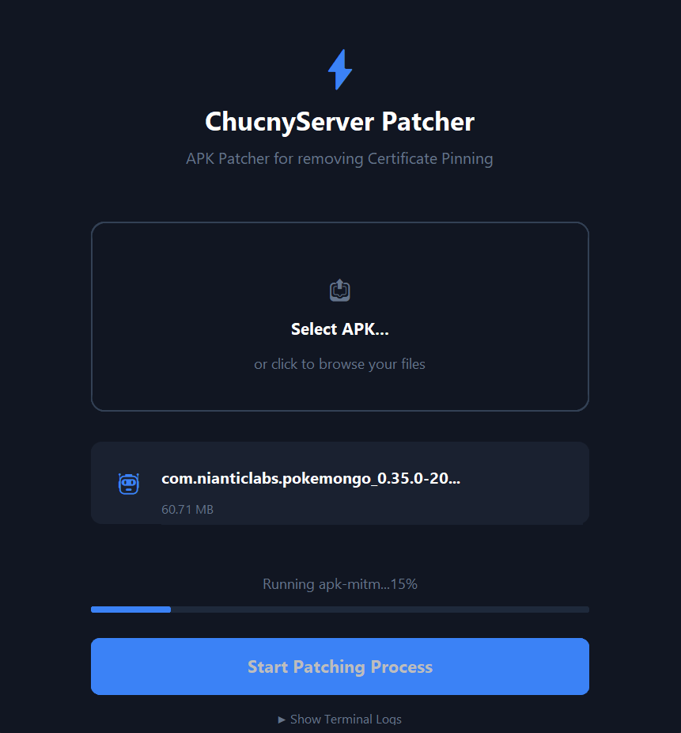

# ChucnyServer

</img><br>
</img></img>

## 📁 Overview
**ChucnyServer** is an open source **MITM** (man in the middle) **0.29.0 Pokemon GO server** made in Python. <br><br>
<a href="https://chucny.github.io"><strong>The ChucnyServer website</strong></a><br><br>
## 🖥️ How to run
1. Run the **DOWNLOAD.py** script inside /scripts. Alternatively, download the dependencies manually (recommended)
2. Get the assets **(DM @chucny on discord to get them if you don't have them)**
3. Run the script called **__main__.py** inside **/chucnyserver**
4. Install the Pokemon GO 0.29.0 APK onto your phone (note: it's a 32-bit APK)
5. Install the file **CA.crt** inside the **/chucnyserver/certs** folder as a **CA certificate** on your phone
6. Go to your Wi-Fi settings and change your **DNS** to the IP shown in the server output
7. Open the **Pokemon GO app** and tap on **Pokemon Trainer Club**
8. Enter any username and password
9. You are now in!<br>

## **⌨️ How to use the terminal manager**<br>
Remember: The terminal manager is still full of bugs and is in Beta.<br>
Run **terminal.py** (don't run __main__.py)

# ChucnyServer Patcher – User Manual & Linux Installation Guide

This guide will help you set up your Linux environment and patch the **Pokémon GO 0.29-0.35 APK** and remove certificate pinning and allow it to connect to your local **ChucnyServer**. Patcher supports 0.29.0 all the way up t 0.35.0 without breaking the app or server.

---

## 📋 Prerequisites

To run the patcher interface and successfully re-pack the APK file, your system must have the following tools installed:

1. **Java Development Kit (JDK)** – Required for signing and aligning the modified APK (`keytool` and `apksigner`).
2. **Node.js (v14 or newer)** – Required to run the patching core engine.
3. **apk-mitm** – The command-line utility that handles the certificate injection process.

---

## 🐧 Linux Installation Guide

Open your terminal and execute the commands corresponding to your Linux distribution.

### 1. Install Java (JDK) and Node.js

#### For Ubuntu / Debian / Mint:
```bash
# Update package repositories
sudo apt update

# Install Java (OpenJDK 17 is recommended)
sudo apt install -y openjdk-17-jdk

# Install Node.js and NPM
sudo apt install -y nodejs npm
```

#### For Arch Linux:
```bash
sudo pacman -Syu
sudo pacman -S jdk17-openjdk nodejs npm
```

#### For Fedora:
```bash
sudo dnf update
sudo dnf install java-17-openjdk-devel nodejs
```

### 2. Install apk-mitm (Globally via NPM)
Once Node.js and its package manager are installed, install `apk-mitm` globally on your machine:

```bash
sudo npm install -g apk-mitm
```

---

## 🛠 How to Use the Patcher

</img>

With all dependencies installed, you can proceed to modify your game client using either the graphical interface or the command line.

### Option A: Using the ChucnyServer Patcher (UI)
1. Open the `/patcher/patcher.py` file in your preferred web browser.
2. Click on the **"Select APK File"** button (or simply drag and drop your downloaded Pokémon GO 0.29.0 APK into the designated area).
3. Click the **"Start Patching Process"** button.
4. The interface will interact with your system utilities (`java`, `node`, `apk-mitm`) to decompile, inject network security overrides, and re-sign the package.
5. Save the output file, usually generated as `pokemon-go-0-29-0-patched.apk`.

### Option B: Using the Terminal Directly
If you prefer bypassing the web UI and running the process manually:

```bash
apk-mitm path/to/pokemon-go-0.29.0.apk
```
*This command will output a newly modified file with the `-patched.apk` suffix in the same directory.*

---

## 📱 Final Device Configuration

1. Transfer your newly generated patch file (`-patched.apk`) onto your Android device and install it.
2. Install the `CA.crt` file (found inside your server directory at `/chucnyserver/certs`) onto your phone storage as a trusted **CA Certificate** via system security settings.
3. Head over to your phone's Wi-Fi configuration and change your primary **DNS** server to match the IP address outputted by your active ChucnyServer terminal.
4. Launch Pokémon GO, select the **"Pokemon Trainer Club"** login option, enter any username/password combination, and enjoy your server!


## 📝 Features
- **World Manager**: manage spawns, PokeStops, gyms, events and more.
- **Raids**: Defeat a powerful boss at a gym. Once defeated, it spawns next to the gym for you to catch
- **Community day & events**: Play different community days
- **Gym battles**: Battle pokemon in gyms!
- **Automatic PokeStop import**: import up to 10000 PokeStops at once via OSM API!
- **Terminal Manager**: An alternative to the graphical World Manager served at localhost:8080. It's still in beta and has lots of bugs.


## 🗄️ How to get assets
1. Send a friend request to me at **@chucny** on discord if you don't have the assets
2. I will respond within a couple of days to hours and provide you with a download link to the assets
3. **Download** the assets
4. Paste the 152 asset files directly to the **/chucnyserver/assets** folder
5. Now run the server

## ⚖️ Why I can't distribute assets publicly
The reason I cannot provide you assets publicly, is because it violates **Copyright Laws**. Pokemon and trademarks are **Nintendo's and The Pokemon Company**'s **Intellectual Property** (IP). If this project had assets, it would get a **DCMA takedown**. By not distributing assets publicly, I can ensure that this project stays entirely legal.

## 🖼️ Credits
- **@mobraxton5-ux** for making the playground
- **maierfelix** for writing some of the logic that is still in this server
- **OpenStreetMap** for POIs and more

### **This project is licensed under the Apache 2.0 license. See LICENSE file for details.**
